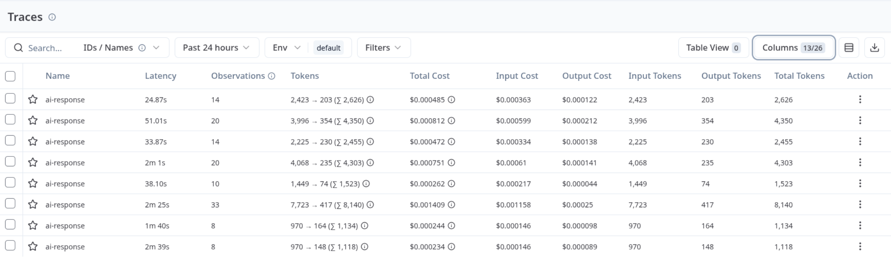
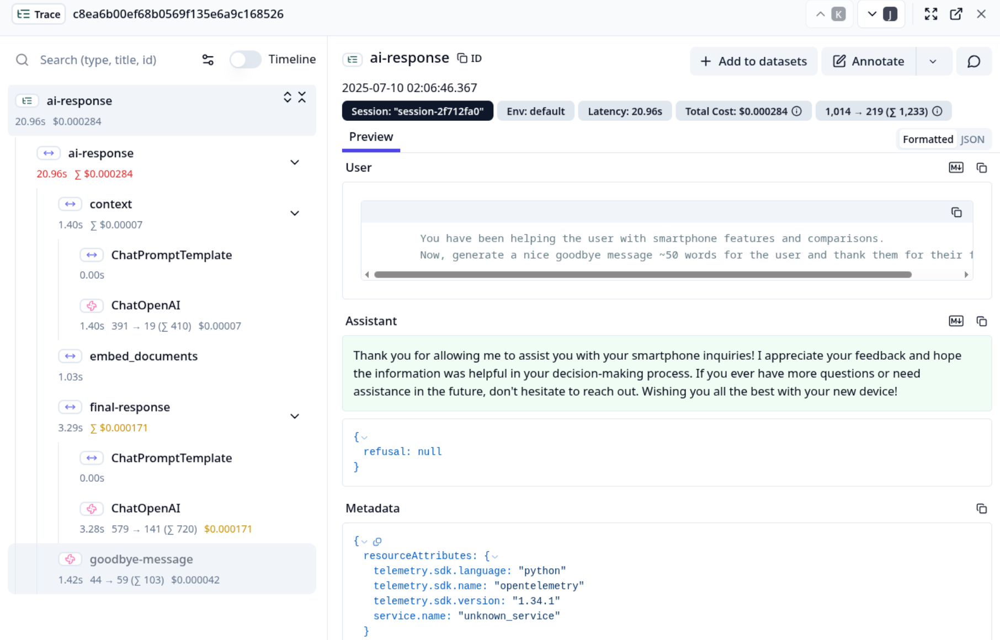

## Langfuse Monitoring

### **Table of Contents**

- [Description](#description)
- [Useful Notes](#useful-notes)
- [Development Steps](#development-steps)
- [Deliverables](#deliverables)
- [Useful Resources](#useful-resources)
    - [Topics and Projects](#topics)
    - [Docs](#docs)

### Description

Langfuse allows you to trace every LLM call and other functions in your app. You can monitor chains, agents, and others. You can track the complete execution flow for API calls, track model usage, and more. It doesn’t matter if you built your app in pure Python, OpenAI SDKs, or LLM frameworks such as [LangChain](https://langfuse.com/docs/integrations/langchain/tracing) and [LlammaIndex](https://langfuse.com/docs/integrations/llama-index/get-started); Langfuse allows you to monitor all of them. Since our chatbot is built with LangChain, we will focus on that here.

### Useful Notes

Collecting metrics from LangChain applications is achieved using callbacks**.** **Callbacks** in LangChain allow you to perform custom actions at different phases of your LLM application. This is valuable for logging, monitoring, streaming, and more. Check out LangChain’s [documentation](https://python.langchain.com/docs/concepts/callbacks/) for an overview of callbacks.

Don’t worry, we won’t be creating any callbacks from scratch. All you need to do is add Langfuse's callback handler wherever you make an LLM call:

```python
from langfuse.langchain import CallbackHandler

langfuse_handler = CallbackHandler()
response = llm.invoke(prompt, config={"callbacks": [langfuse_handler]})
```

The above snippet uses v3 of the Langfuse SDK. We’re initializing a callback handler and passing it when invoking the LLM. Ensure you’ve set the keys and host for your Langfuse instance in your `.env` file.

That’s it! Now, every time an LLM call is made, the traces will be captured by Langfus, and you can view them in the web interface. Besides `.invoke()` methods, you can also add the callback handler to `.run()`, `.call()`, `.predict()`, `.async`, `.batch()`, and streaming interfaces in LangChain.

You can also further customize the callback handler, such as adding a session ID to the trace allows you to group multiple LLM interactions that are part of the same conversation. Additionally, you can specify run names, user ID, tags, inputs, outputs, [and others](https://langfuse.com/docs/integrations/langchain/tracing#dynamic-trace-attributes) via the metadata field. Here’s an example of how to do that:

```python
response = llm.invoke(prompt, config={
	 "run_naame": "my-run",
	 "callbacks": [langfuse_handler],
	 "metadata": {
	    "langfuse_session_id": "your-session-id",
        "langfuse_user_id": "hyper-user",
        "langfuse_tags": ["dev", "test"]
     },
})
```

Langfuse also allows you to monitor any other function that you want. Here, you need to use the `observe` decorator:

```python
from langfuse import observe

@observe(name="hello_world")  # set run name
def hello():
	print("Hello, world!")
```

You could also use this decorator alongside the callback handler to group multiple LangChain runs into a single trace. To set attributes, you can update the trace as shown:

```python
from langfuse import observe, get_client

@observe(name="hello_world") # set trace name
def hello():   
  langfuse_client = get_client()
  
  langfuse_client.update_current_trace(
      name="hello_world",
      session_id="my_session",
  )
  print("Hello, world!") 
```

Refer to the [documentation](https://langfuse.com/docs/get-started) for more details on monitoring LangChain applications.

### Development Steps

In this task, we need to monitor our data loader, tool invocations, and any LLM calls. Additionally, we also need to group related traces by including a session identifier or user ID. Thus, ensure that you add both a session ID and user ID in the metadata field. Finally, all LangChain runs need to be grouped into a single trace, so we will need to use the `observe` decorator for the `main` function and include metadata accordingly.

To get a unique session/user every time, you can use the `uuid` library as follows:

```python
import uuid

session_name = f"session-{uuid.uuid4().hex[:8]}"
user_id = f"user-{uuid.uuid4().hex[:8]}"

# or create a list of predefined users
users = ["James", "George", "Mike", "Sherlock"]
user_id = users[uuid.uuid4().int % len(users)]

```

This allows you to simulate an actual web environment where the session/user ID would be different for various users. Once the task is complete, you should see metrics being sent to Langfuse, such as tokens used, cost, latency, inputs, outputs, and others.

Here’s a checklist of what you need to do:

- Use the `observe` decorator to monitor the data loader/vector store(`embed_documents()`), tool calls(`generate_context()`) and `main()` functions.
- Add a session ID in the `main()` function to group related traces (remember to create a unique session as described above).
- Use the callback handler to monitor every chain invocation; there are 3 invocations. To identify the traces, you can customize the run names as follows:
  - Context chain — `context`;
  - Final response — `final-response`;
  - Goodbye message — `goodbye-message`;
- For the `observe` decorator, set the `name` parameter to the function name (e.g., `name="generate-context"` for the `generate_context()` function) and update the trace with the session ID, user ID, and run name (e.g., `ai-response`).
- Add a user ID in the metadata field for every monitored part (you can use the `uuid` library to generate a unique user ID or use a predefined list of users).
- Keep the given code mostly the same and make only the necessary additions for the above requirements.

Here are some examples of what you would see in the Langfuse UI:

Example 1: *Traces*



Example 2: *Trace details*



### Deliverables

Your code should now integrate Langfuse monitoring using both the `observe` decorator as well as the `CallbackHandler` for Langchain interfaces. When you run the code and send some queries, you should see traces in the web UI showing inputs, outputs, latency, cost, tokens, and other aspects of the app.

### **Useful Resources**

### **Topics**
- [Overview of Langfuse](https://hyperskill.org/learn/step/52531).
- [Further steps of Langfuse](https://hyperskill.org/learn/step/52629).

### **Docs**

- [Tracing for LangChain apps](https://langfuse.com/docs/integrations/langchain/tracing).
- [LangChain Runnable configuration](https://python.langchain.com/api_reference/core/runnables/langchain_core.runnables.config.RunnableConfig.html).


