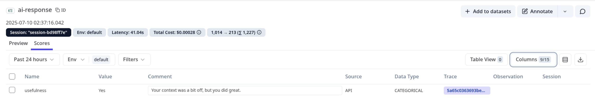

## Collecting User Feedback

### **Table of Contents**

- [Description](#description)
- [Useful Notes](#useful-notes)
- [Development Steps](#development-steps)
- [Deliverables](#deliverables)
- [Useful Resources](#useful-resources)
  - [Docs](#docs)

### Description

Now, we have an application that helps users choose a good smartphone on our site. In addition, we can now see how the application is performing: the cost of each LLM call, the number of tokens used, latency, and other metrics. But, how can we evaluate the correctness, relevance, and precision of the responses our chatbot is giving? This is why we need to add evaluation to RAG applications.

Here, we’d like to assess how effectively the system retrieves and integrates external knowledge, as well as the accuracy of generated responses. This will help us understand strengths, pinpoint weaknesses, and improve our chatbot.

There are various evaluation methods that we could use to assess how well an LLM application is performing. We could collect user feedback, perform manual annotation of traces, or perform model-based evaluations (LLM-as-a-judge) using frameworks such as [Ragas](https://docs.ragas.io/en/stable/) and [DeepEval](https://docs.confident-ai.com/docs/getting-started). We’ll delve into all these approaches for the remainder of the project.

### Useful Notes

Regardless of the method you use, Langfuse uses a scoring system to store the values you get after running the evaluations (along with optional comments). Scores could be numeric, categorical, or boolean. Scores are associated with a particular trace. To learn more about scores, check out the [documentation.](https://langfuse.com/docs/scores/data-model)

Once you’ve determined the type of scores you would like to use, the next step is to to run evaluations. This would involve collecting feedback or running model-based evaluations. For now, let’s focus on user feedback:

```python
feedback = input("Was this answer helpful? (Yes/No): ")
user_comment = input("Please give us a reason for your answer. This will help us improve: ")
```

Of course, in a production environment, this might be collected via UI buttons and input fields. Finally, we need to send the scores to Langfuse and associate the scores with the relevant trace that we retrieved earlier. For example, here is how we can score the above trace:

```python
langfuse_client.score_current_trace(
    name="usefulness",
    value=feedback,
    data_type="CATEGORICAL",
    comment=user_comment
)
```

You should see the user feedback in the UI for that particular trace:



Once you see the user feedback, you can check the trace’s inputs and outputs to understand the ratings thus make informed decisions. Regardless of how you collect user feedback or the evaluations you run, the flow is similar:

- Collect feedback/run evaluations;
- Push the scores to Langfuse for that trace.

In the next stages, we’ll see how to perform annotation and run model-based evaluations using Ragas.

### Development Steps

For now, if the input is exit or end, collect feedback from the user to find out if the recommendations were helpful. In this case, you can use a rating system of Yes/No and also ask users to provide a comment. Then, once you have the scores, send them to Langfuse, associating them with the current trace.

```python
goodbye_message = llm.invoke(goodbye_prompt)
# collect feedback
# retrieve the relevant trace
# associate the score with that trace and push scores and comments to Langfuse

print(f"System: {goodbye_message.content}")
```
### Deliverables
Your code should now collect user feedback and send it to Langfuse. When you run the code and send some queries, you should see the scores in the web UI showing the user feedback and comments for that trace.

### **Useful Resources**

### **Docs**

- [Evaluation data model](https://langfuse.com/docs/scores/data-model).
- [Adding custom scores](https://langfuse.com/docs/scores/custom).