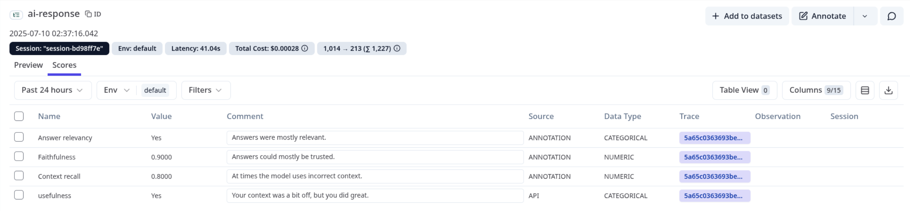

## Annotation

### **Table of Contents**

- [Description](#description)
- [Useful Notes](#useful-notes)
- [Development Steps](#development-steps)
- [Deliverables](#deliverables)
- [Useful Resources](#useful-resources)
    - [Docs](#docs)

### Description

Another important aspect of LLM evaluation is manual data annotation. Here, experts review and tag or categorize the generated responses. This is particularly useful for benchmarking during development to pinpoint strengths and weaknesses. During this process, experts can also curate high-quality datasets (golden dataset), for model fine-tuning or model-based evaluations that need the ground truth. Unfortunately, the process is time-consuming and could be costly where there are large volumes of data to annotate.

### Useful Notes

Langfuse allows you to easily annotate traces via the UI. Just open a trace or observation and add scores to it. You must first create a score configuration for various score types. Score configs cannot be deleted or edited once you create them. Check out [the documentation](https://langfuse.com/docs/scores/annotation#single-trace) for more details on annotations in Langfuse.

### Development Steps

In this stage, we’d like to annotate the responses our LLM produces across three dimensions:

- Faithfulness — how factually consistent is the response with the retrieved context?
- Answer relevancy — does the response address the question?
- Context recall — how well does the model retrieve the needed context?

Here are the scores in Langfuse UI:

You can always use more dimensions, but these are a nice place to start. Once you identify and annotate relevant traces, you can then add the final response observation to a [dataset](https://langfuse.com/docs/datasets/overview) for use later.

### Deliverables
There are no code deliverables for this task. But you should now be able to annotate traces in the Langfuse UI. You should also know how to create a dataset from the annotated traces, which you will use later for model-based evaluations.
### Useful Resources

### Docs

- [Human annotation](https://langfuse.com/docs/scores/annotation).
- [Datasets](https://langfuse.com/docs/datasets/overview).