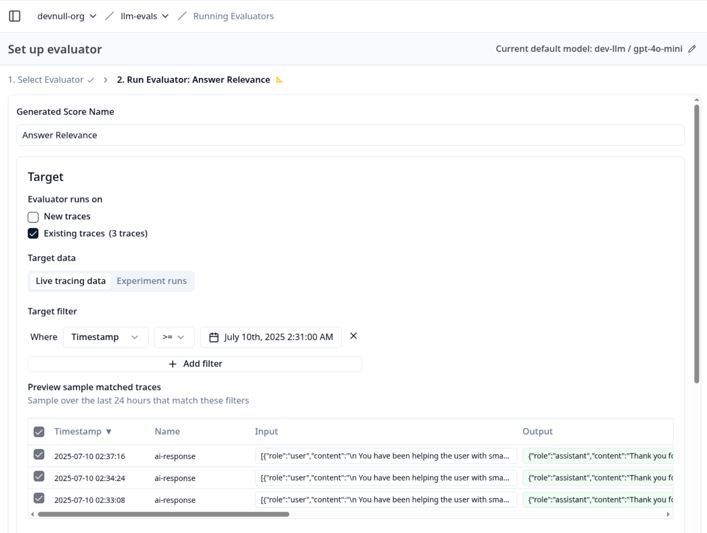
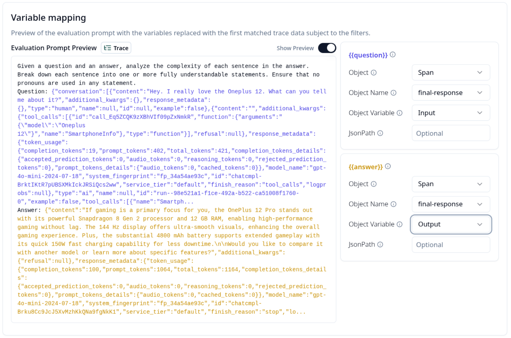
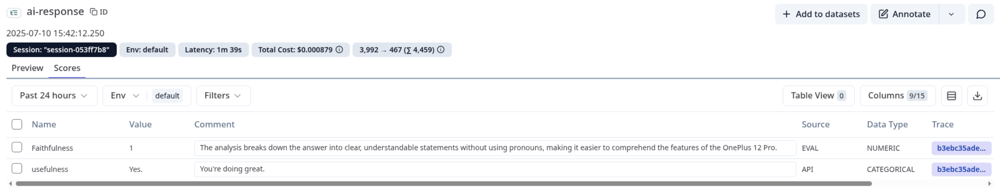

### Model-based Evaluation

### **Table of Contents**

- [Description](#description)
- [Useful Notes](#useful-notes)
- [Development Steps](#development-steps)
- [Deliverables](#deliverables)
- [Useful Resources](#useful-resources)
  - [Docs](#docs)

### Description

So far, we have utilized "human-as-a-judge" evaluations from user feedback and manual annotation to determine how the app performs. Unfortunately, manually annotating large datasets is time-consuming and costly. Additionally, users may not always provide feedback. Model-based evaluations come to the rescue, providing a way to use LLMs as judges to run automated evaluations on our datasets. This is also known as LLM-as-a-judge evaluation.

### Useful Notes

The evaluation of LLM-powered applications has matured significantly. The focus has moved beyond traditional metrics such as BLEU and ROUGE, which were inherited from machine translation and text summarization. While useful for measuring lexical overlap, these older metrics fall short because they cannot distinguish between a factually correct answer and one that is simply worded similarly to a reference text. They fail to assess the two most critical aspects of modern apps:

- The quality of the retrieved information.
- Whether the generated answer is factually grounded in that information.

This shortcoming has driven a shift towards modular evaluation, where the retrieval and generation components are diagnosed separately with more sophisticated, meaning-focused metrics. Frameworks like [Ragas](https://docs.ragas.io/en/stable/) and [DeepEval](https://deepeval.com/docs/evaluation-introduction) make this modern approach seamless by employing a suite of metrics designed to provide a granular and actionable assessment. Follow the inline links to learn more about each metric and the details of how they are calculated.

To evaluate the retriever, Ragas uses metrics like [context precision](https://docs.ragas.io/en/latest/concepts/metrics/available_metrics/context_precision/) to measure the relevance of the retrieved passages. [Context recall](https://docs.ragas.io/en/latest/concepts/metrics/available_metrics/context_recall/) then verifies that all necessary information was fetched. It can even drill down to [context entities recall](https://docs.ragas.io/en/latest/concepts/metrics/available_metrics/context_entities_recall/) for fact-heavy queries and assess how often a system makes errors with [noise sensitivity](https://docs.ragas.io/en/latest/concepts/metrics/available_metrics/noise_sensitivity/).

For the generation phase, it moves far beyond simple text similarity. [Faithfulness](https://docs.ragas.io/en/latest/concepts/metrics/available_metrics/faithfulness/) directly tackles the problem of hallucination by verifying that every statement in the generated answer is supported by the provided context. Meanwhile, [response relevancy](https://docs.ragas.io/en/latest/concepts/metrics/available_metrics/answer_relevance/) ensures the answer is not just faithful but also on-topic and directly addresses the user's query.

Furthermore, as systems evolve into more complex agentic systems that can utilize tools, the scope of evaluation must expand accordingly. [Tool call accuracy](https://docs.ragas.io/en/latest/concepts/metrics/available_metrics/agents/#tool-call-accuracy) ****evaluates whether the appropriate tool for a given task was selected and that the correct parameters were supplied for each tool call.

### Development Steps

There are various approaches you can take to perform model-based evaluations. First, Langfuse allows you to run them directly on your datasets and traces from the UI. But first, make sure you’re running the latest version of Langfuse. You can ensure that by running the following command from the Langfuse folder to update your local installation:

```bash
docker compose up --pull always
```

Then, add an LLM connection that will be used to run evaluations. You can do so from Project Settings> LLM Connections. Next, [set up your LLM-as-a-judge pipeline](https://langfuse.com/docs/scores/model-based-evals) from the UI:



Ensure that variables are mapped correctly to avoid false analysis:



That’s it. When you click `Execute`, and wait a few seconds, you should now see the scores and comments from the model in the UI:



You can add and experiment with as many evaluators as you want. If you'd like to learn more about using Langfuse with Ragas to run a custom evaluation pipeline, check out [this cookbook](https://langfuse.com/guides/cookbook/evaluation_of_rag_with_ragas). This will help you gain an in-depth understanding of what is happening under the hood and run evals not built into Langfuse.

### Deliverables

There are no code deliverables for this task. But you should now be able to run various model-based evaluations from the Langfuse UI. As an extra challenge, you should also be able to run custom evaluations and push scores to Langfuse.

### **Useful Resources**

### **Docs**

- [LLM-as-a-judge evaluation](https://langfuse.com/docs/scores/model-based-evals).
- [Ragas Metrics](https://docs.ragas.io/en/stable/concepts/metrics/available_metrics/).
- [Custom evals with Ragas](https://langfuse.com/guides/cookbook/evaluation_of_rag_with_ragas).